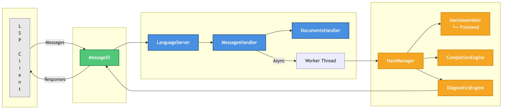

# Hack (Nand2Tetris) Language Server

A Language Server Protocol (LSP) implementation in C++ for the Hack assembly language from the Nand2Tetris course.

## Architecture



The codebase is organized into three main layers:
- **`lsp/`** - LSP protocol layer (types, messages, params, responses, errors)
- **`core/`** - Server implementation (handlers, document structures, transport I/O)
- **`hack/`** - Hack-specific functionality (assembler integration, diagnostics, completion)

## Features

- [x] Document synchronization (open, change, close)
- [x] Incremental text updates
- [x] Code completion (`@`, `=`, `;` triggers)
- [x] Real-time diagnostics
- [x] Asynchronous processing


## Getting Started

### Prerequisites
- C++20 compatible compiler (clang++ or g++)
- CMake 3.16 or higher
- HackAssembler frontend (included in `external/HackAssembler/`)

## Build & Run

### Build
```bash
cmake -B build && cmake --build build
```

### Run
```bash
./build/bin/hack-ls --stdio
```
The server communicates via stdin/stdout using the LSP protocol.

## Testing

The project includes a test script (`test.sh`) that exercises the LSP server with multiple Hack assembly files.

```bash
./test.sh --shutdown | ./build/bin/hack-ls
```

The test script will:
- Initialize the LSP server
- Open multiple `.asm` files from `tests/asm/` directory
- Test document changes (`didChange`)
- Test completion requests with various trigger characters (`@`, `=`, `;`)
- Test manual completion triggers
- Properly shutdown the server (when using `--shutdown` flag)

For all available options, run:
```bash
./test.sh -h
```

## Development

See [TODO.txt](TODO.txt) for current development priorities and known issues.

## License

MIT
